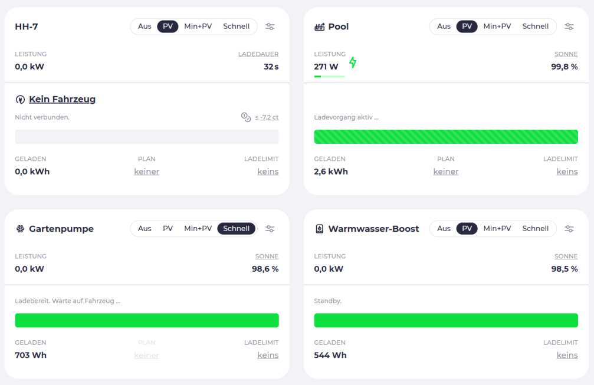

# Master PV surplus handling with evcc and Home Assistant

Using power from your own solar panels to charge your EV is great, but what if you have more power available — or if your EV is already fully charged? I am personally facing this challenge for quite a while now and used several helpers or blueprints, with and without Home Assistant, to control my various devices (with noticeable energy consumption) at my home.

For me, the search is over — I already use evcc to charge my car with PV power — it seems consequent to do the same for other home devices as well.

Since the end of May 2025 you can use [evcc](https://github.com/evcc-io/evcc) to control any Home Assistant entity that implements the `turn_on` and `turn_off` services. This means evcc can switch devices like smart plugs, or even Home Assistant automations (which is IMHO the entrance to 'PV surplus handling' heaven).

__Kudos to [@niklaswa](https://github.com/niklaswa)__ for adding this feature to evcc! ... and also __Kudos to [@mfuchs1984](https://github.com/mfuchs1984)__ & __[@VolkerK62](https://github.com/VolkerK62)__ for their additional explanations in the [evcc github discussion](https://github.com/evcc-io/evcc/discussions/22378), which helped me a lot to understand the theory of operation.


## Some basic stuff first: A = W / V

Something you must have in mind — evcc is __current__ (in Ampere) based — for most of the other electrical devices in my home __power__ (in Watt) is the main unit. So you must convert the Power (in Watt) to current (in Ampere) by using the formula `A = W / V` (where `V` is the voltage, `W` is the watts and `A` is the current) [must be related to this `U = R * I` thing] . In my case, I am using 230V as voltage, so I can calculate the current by dividing the power in Watt by 230V.

So when I want to specify a device that requires 1000W, I can calculate the current by dividing 1000W by 230V, which gives me approximately 4.35A.


## Introduction to my use case

Let's go through my personal use case, and then you can decide if this is also useful for you. Hopefully this will help you to decide If you simply copy & paste this to your installation or if you want to adapt it to your needs (or if you just want to stick with your current solution).


### My home

Here at my home I have (beside my lovely family)...

#### Power generation side
- 16kWp — via 42 solar panels on the east and west side of my roof
- a SENEC.Home V3 system (a decision __I very much regret__)
  - with integrated 10 kW battery
  - with integrated two inverters (where I can fetch data separate)
- an additional SMA inverter
- a tibber pulse/bridge (to be independent of any data from the SENEC.Home V3 system)
- grid price data from the Tibber API
- PV forcast data

#### Power consumption side
- An EV (Ford Mach-E extended range) — fully integrated into Home Assistant via the [FordPass integration](https://github.com/marq24/ha-fordpass) (connected via a goE-Charger)
- A Waterkotte heat pump (for heating and hot water) [~ 3000W] — fully integrated into Home Assistant via the [Waterkotte +2020 integration](https://github.com/marq24/ha-waterkotte)
- A Pool pump and an additional pool heater/cooler [~ 1000W] — controlled via a Shelly Pro 4PM and integrated into Home Assistant via the Shelly integration
- A garden water pump [~ 500W] — controlled via the same Shelly Pro 4PM (but a different channel)

#### Additional challenge — The power consumption of the devices must not be constant

The power consumption of the Waterkotte heat pump, the pool pump & heating and from the garden pump is __not constant__. As examples:

- The Waterkotte heat pump is running in a cycle, so the power consumption will vary between 0W (when not running) and ~3000W (when running at full power). The power consumption will also vary depending on the current temperature of the water and the target temperature.

- When the garden pump is running, the pump will automatically stop if the water-pressure is too high and start again when the pressure has dropped under a specific threshold (good old mechanical switch).

- The pool pump has a rpm control, so the power consumption will vary. And last but not least, the pool heater/cooler is also not running all the time (it stops when the target temperature is reached).

### The overall goal

I want that evcc will control all these devices at my home and make a smart decition, when to turn on and off which device to maximize the use of the available surplus power.

As already mentioned — since a short while evcc is able to control Home Assistant entities and this allows me finally to archive my overall goal (from a single source). The key is the recently added `integrateddevice` and the smart-switches support in evcc. Continue to read what I set up here @ home. 

## The Key: define so called `integrateddevice` as `charger` in evcc

The [evcc documentation for smart switches](https://docs.evcc.io/docs/devices/smartswitches#home-assistant-schalter) explains how to define a Home Assistant device (or Shelly's) as a `charger` in evcc.

This documentation is quite short (for sure, containing everything you need to know) — but this is offering so many new options that go way beyond 'simple' EV charging. I have to admit that I was not aware of this feature before — and I am still surprised __how powerful__ this can be. __The `integrateddevice: true` in combination with smart-switches is a game changer__ for me!

But let's get back to the basics. The main effect of the `integrateddevice` property is (in the configuration GUI you must enable the 'extended options'), that a configured loadpoint using such an 'integrateddevice'-charger will not have an option to select a vehicle (at the loadpoint). Which is very logical at the end.

Once you have defined such a charger and configured a loadpoint with it, you can instantly use it to `turn_on` or `turn_off` _any_ Home Assistant entity supporting the `turn_on`, `turn_off` service (starting with evcc v0.206) or any other smart switch directly supported by evcc (like Shelly, Tasmota or other smart plugs). But at the end of the day, when you have a device that is switchable in Home Assistant, then now evcc can turn it on and off.

__Turn ON__ means that the device will be switched on when the evcc has detected that there is enough surplus power available (or when the grid price is low enough). __Turn OFF__ means, that the device will be switched off, when there is not enough surplus power available (or when the grid price is too high).


## Understanding priority, minCurrent/maxCurrent and how evcc control on/off of a device

But once you have defined such a charger(s) and loadpoint(s) in evcc, how does evcc decide which device to turn on or off?

So coming back to my home scenario — First I want that my EV get charged till the configured SOC — I am doing this since a while now — the only adjustment I made recently to specify my loadpoint with the configured goE-Charger the `priority: 9` (the highest priority).

Second, I want is that my pool pump (and heating/cooling) will be switched on when there is enough surplus power available. I have configured this with a `priority: 8` and a `minCurrent: 4.5` (1000W/230V = 4,3478...) (so that the pool pump will only be switched on when there is at least 1000W surplus power available).

Third is the garden pump, which is configured with a `priority: 7` and a `minCurrent: 2.17` (500W/230V = 2,1739...).

And finally, the hot-water-boost for the Waterkotte heat pump [where I raise the set-temperature of the hot water from 46°C up to 58°C via a Home Assistant automation (and ignoring all the possible existing SG-Ready stuff)]. It's configured with the lowest `priority: 1` and a `minCurrent: 13` and should only run, if there is at least for more than one-hour additional surplus power available (I have left the logic about remaining (expected) PV-production/forcast in the ON-SWITCH logic of my HA automation.

### So how all these requirements are handled by evcc?

The configured minCurrent must be considered as the required available power 'overproduction' (that might be currently just fed into the grid). As soon as evcc detects that there is enough surplus power available, it will turn on the device (or devices) that can be powered by the available energy.

When you have a device A with a high priority and a `minCurrent` of 4.5A (~1000W) and a second device B with lower priority with `minCurrent` of 2A (460W) and the current surplus power is 3.5A (~800W), then evcc will turn on the second device B first.

When the second device B is now running and consuming 2A (460W), the remaining surplus power will be 340W.

When now this remaining surplus power will increase over 540W then (and if I have not misunderstood something fundamentally wrong):
- The total available surplus power becomes over 1000W, since 540W + 460W (of the running second device)
- So the total available surplus power can feed the demand of device A 
- Then evcc will turn off the second device B and turn on the first device A, since device A has a higher priority than device B

[Please let me know if I am wrong with this].

If then the surplus power is increasing to a total of 1460W, then evcc will turn back on the second device.

__And__ it's also important to know, that evcc will always just monitor the actual power consumption of the devices that are currently running (no matter of the configured min/maxCurrents). E.g., if a device turned on by evcc has a configured minCurrent of 4.5A but is actually consuming less power (or none at all) — such as when a heat pump reaches its target temperature — evcc will use all available surplus power to determine which device to turn on next, without subtracting any "theoretical power consumption" (from the none running - but turn on - device).

So evcc uses __only the actual power consumption__ of the turned-on devices to calculate the total surplus power available.

---

Mhh - does this all sound too complicated? Well, at the end of the day, evcc will turn on the devices with the highest priority first. If the power is not enough to turn on the device with the highest priority, evcc will turn on the next device with the next highest priority where the minCurrent is lower than the available power.


## Putting it all together — how I have configured my home in evcc?

To solve my use case, I have defined three additional chargers and loadpoints in evcc, which are finally controlling the garden-pump, the pool-pump and the Waterkotte. When you take a look at the configuration below, you will realize that the overall configuration is quite simple and straightforward (no matter if it's done via the Configuration GUI or via the evcc.yaml.

This makes it ever way more astonishing that I have not thought about this before. The __Simplest solutions__ are __always the best__ ones, right?

### My evcc main view


### My evcc.yaml charger & loadpoint configuration

The minCurrent and maxCurrent values can be adjusted in the GUI-based configuration as numeric inputs or on the main screen of evcc per loadpoint (dropdown selects).

_I haven't figured out yet, how to adjust the minCurrent/maxCurrent via the evcc.yaml configuration file. Using minCurrent for a loadpoint, give me 'ignoring deprecated minCurrent...' during evcc startup, so I am using the GUI for this._

Please find below my evcc configuration for the chargers and loadpoints, that I currently used to control my home devices (as described above):

```yaml
interval: 10s # 10 seconds works fine in my setup - does not have to be the case in yours

log: info

chargers:
  - name: go-e
    type: template
    template: go-e-v3
    host: [IP-OF-MY-GOECHARGER]

  - name: pool-shelly_switch
    type: template
    template: shelly
    standbypower: 0
    integrateddevice: true
    heating: false
    host: [IP-OF-MY-SHELLY-PRO-4PM]
    channel: 0
    icon: heatexchange

  - name: garden-shelly_switch
    type: template
    template: shelly
    standbypower: 0
    integrateddevice: true
    heating: false
    host: [IP-OF-MY-SHELLY-PRO-4PM]
    channel: 1
    icon: compute

  - name: heatpump-water_ha_switch
    type: template
    template: homeassistant-switch
    standbypower: 0
    integrateddevice: true
    heating: true
    uri: http://[MY-HA-INSTANCE]:8123
    token: [MY-HA-TOKEN]
    # the homeassistant entity that is used to turn on/off the hot water-boost
    # (in my case this is a helper switch used by an automation)
    switch: input_boolean.wkh_hotwater_switch
    # the homeassistant entity providing the current power consumption
    # of the heat pump (must be in Watt)!
    power: sensor.wkh_power_electric_in_watt 
    icon: waterheater

meters:
  - name: [MY METERS HERE]
    ...

vehicles:
  - name: [MY VEHCILE HERE]
    ...

loadpoints:
  - title: HH-7
    charger: go-e
    priority: 3
    enable:
      threshold: 0
      delay: 0.5m
    disable:
      threshold: 0
      delay: 1.5m

  - title: Pool
    charger: pool-shelly_switch
    priority: 4
    enable:
      threshold: 0
      delay: 5m
    disable:
      threshold: 0
      delay: 5m

  - title: Gartenpumpe
    charger: garden-shelly_switch
    priority: 5
    mode: now # garden pump should always be 'ON' right now
    enable:
      threshold: 0
      delay: 0.5m
    disable:
      threshold: 0
      delay: 10m

  - title: Warmwasser-Boost
    charger: heatpump-water_ha_switch
    priority: 1
    enable:
      threshold: 0
      delay: 60m # at least 60min PV surplus power
    disable:
      threshold: 0
      delay: 5m

```

### Things that are not running 100% right now

Since all this is quite new (to me), some things are not running perfect yet:

- When the Waterkotte hot water temperature is below the default set-point (~42°C) then 'of course the heat pump will start running' — therefore, the heatpump power-meter (configured as `powerentity`) will report energy consumption to evcc. And since evcc did not turn the power `on` (for the hot water boost), there is a log message inform you about this inconsistency. [This can be solved by creating a separate template-based HA sensor, that will only repot the power usage, if the boost-switch in HA is turned on. But I have not done this yet.]

